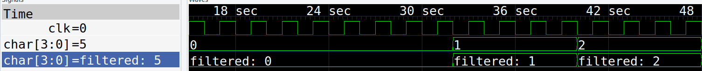
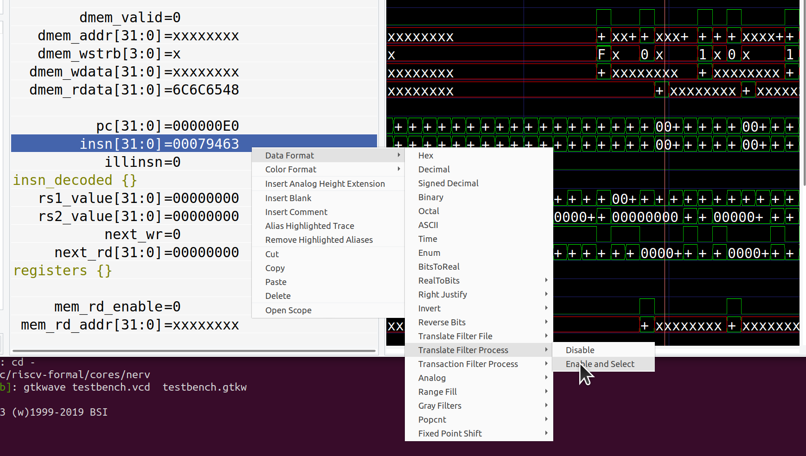

# GTKWave Python filter process

GTKWave can pass your values through a filter and then display the result. This is 
useful for things like:
    
    * state machines codes -> helpful names
    * machine code -> assembly language
    * packed data -> human readable versions

# Setup

Adapt the [example filter](filter-process.py), making sure your lines end with a newline char.

Choose the filter:

Enjoy easier to read traces!
